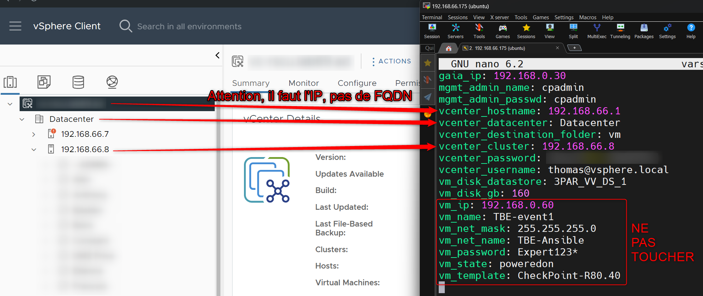

# Orchestrateur VM CheckPoint

## Introduction
L'**Orchestrateur VM CheckPoint** automatise le déploiement et la configuration initiale des machines virtuelles (VM) CheckPoint en utilisant Ansible. Il permet de configurer rapidement les VMs en automatisant des tâches telles que l'assistant de première configuration (First Time Wizard, FTW) et l'attribution de l'IP de gestion. Cet outil aide à simuler des environnements clients en déployant plusieurs VMs efficacement.

## Table des Matières
- [Introduction](#introduction)
- [Fonctionnalités](#fonctionnalités)
- [Prérequis](#prérequis)
- [Installation](#installation)
- [Configuration](#configuration)
- [Utilisation](#utilisation)
- [Dépannage](#dépannage)
- [Contributeurs](#contributeurs)
- [Licence](#licence)

## Fonctionnalités
- Déploiement automatisé des VMs CheckPoint à l'aide de templates.
- Personnalisation des propriétés des VMs telles que CPU, RAM, taille de disque et IP de gestion (à faire manuellement sur l'interface vSphère)
- Automatisation du First Time Wizard pour différents types de VM : Gateway, Management, SmartEvent.
- Création facile de VMs via un script Python et des playbooks YAML.
- Gestion et validation des IPs via des pings ICMP.
- Compatibilité avec vSphère, ou bien divers environnements de virtualisation (vSphere, AWS, Azure, etc.) mais des ajustements sont nécessaires.

## Prérequis
- Ansible
- Python 3.x
- Bibliothèques Python : Paramiko, ipaddress, requests, PyVmomi
- Templates CheckPoint
- Fournisseur d'infrastructure virtuelle (vSphere ici)

## Installation
1. Installez Ubuntu Server (ou une autre distribution Linux) sur votre VM de gestion.
2. Mettez à jour le système :
   ```bash
   sudo apt update && sudo apt upgrade -y
   ```
3. Installez les dépendances requises :
   ```bash
   sudo apt install python3 python3-pip software-properties-common -y
   pip3 install --upgrade setuptools
   pip3 install paramiko ipaddress requests PyVmomi ansible
   ```
4. Redémarrez le système :
   ```bash
   sudo reboot
   ```

## Configuration
1. Modifiez le fichier `vars.yaml` pour l'adapter à votre infrastructure vSphere, y compris les détails sur les templates de VM et les configurations réseau.

3. Assurez-vous que le fichier `hosts.yaml` ne soit pas modifié. Le script le modifiera pendant le déploiement, il doit cependant rester intact.

## Utilisation
1. Lancez le script Python :
   ```bash
   python3 orchestrator.py
   ```
2. Fournissez les informations demandées :
   - Version de CheckPoint à installer (ex : 81.10).
   - Noms des VMs (si plusieurs, séparez-les par des espaces).
   - Type de VM : Gateway (G), Management (M) ou SmartEvent (E).
   - Adresses IP de gestion pour chaque VM.
3. Confirmez la configuration et l'orchestrateur se chargera du reste.

### Exemple de Saisie et sortie du script:
```bash
Quelle version de CheckPoint voulez-vous installer [par ex. 81.20] : 81.10
Quel est le nom de la/des VM ? TBE-gw TBE-mgmt
Installation d'une Gateway, Management ou SmartEvent ? g m
Quelle sera l'adresse IP de la VM ? : 192.168.0.25 192.168.0.40

nom de la VM: TBE-gw   Gateway / Management / Event: g    IP: 192.168.0.25   Masque: 255.255.255.0   Version de la VM: R81.10


nom de la VM: TBE-mgmt   Gateway / Management / Event: m    IP: 192.168.0.40   Masque: 255.255.255.0   Version de la VM: R81.10

Les informations sont elles correctes? [O/N] O
Création de la VM en cours...
VM déployée!
La VM est en cours de démarrage, veuillez patienter...
La VM est en cours de démarrage, veuillez patienter...
La VM est en cours de démarrage, veuillez patienter...
Passage du Clish au Bash en cours...
Changement du shell terminé!
Changement de l'adresse IP en cours...
Changement de l'adresse IP terminée.
La nouvelle IP 192.168.0.25 répond.
L'adresse IP dans le fichier des hôtes a été mise à jour en 192.168.0.25.
First Time Wizard de la Gateway en cours, veuillez patienter...
La VM est prête!
Création de la VM en cours...
VM déployée!
La VM est en cours de démarrage, veuillez patienter...
La VM est en cours de démarrage, veuillez patienter...
La VM est en cours de démarrage, veuillez patienter...
Passage du Clish au Bash en cours...
Changement du shell terminé!
Changement de l'adresse IP en cours...
Changement de l'adresse IP terminée.
La VM ne ping pas
La nouvelle IP 192.168.0.40 répond.
L'adresse IP dans le fichier des hôtes a été mise à jour en 192.168.0.40.
First Time Wizard du Management en cours, veuillez patienter...
La VM est prête!
```


## Dépannage
- Assurez-vous que l'ICMP est activé sur votre réseau pour qu'Ansible puisse vérifier l'état des VMs.
- Si le playbook échoue sur `change_shell.yaml`, vérifiez la configuration du shell pour l'utilisateur `admin` sur la VM.
- Vérifiez la configuration de la taille des disques si le déploiement échoue en raison de problèmes de stockage.

## Contributeurs
- **ThomasDuke** - Développeur

## Licence
Ce projet est sous licence MIT.
